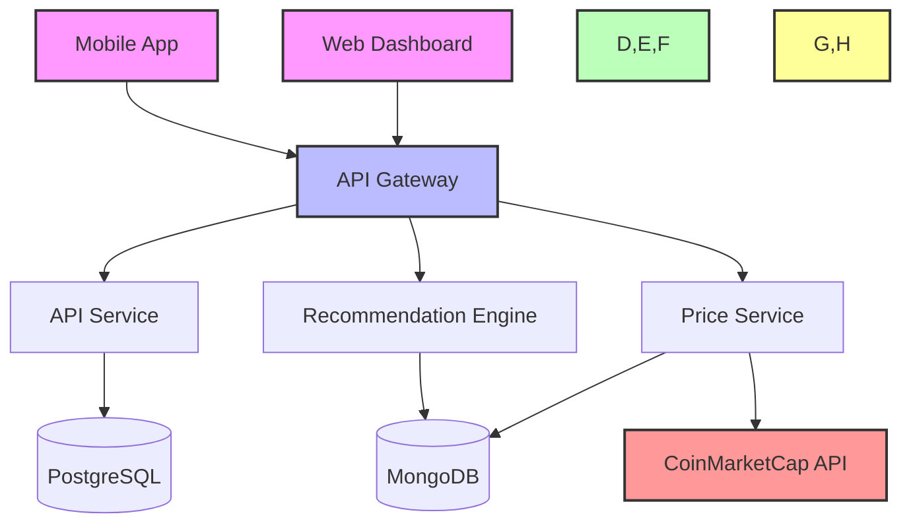
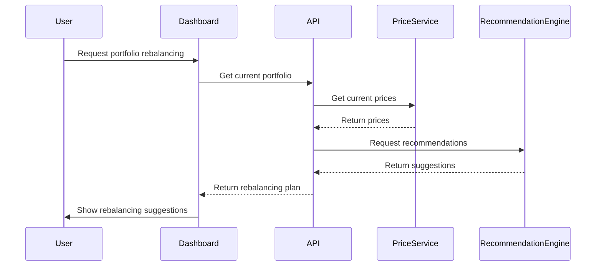
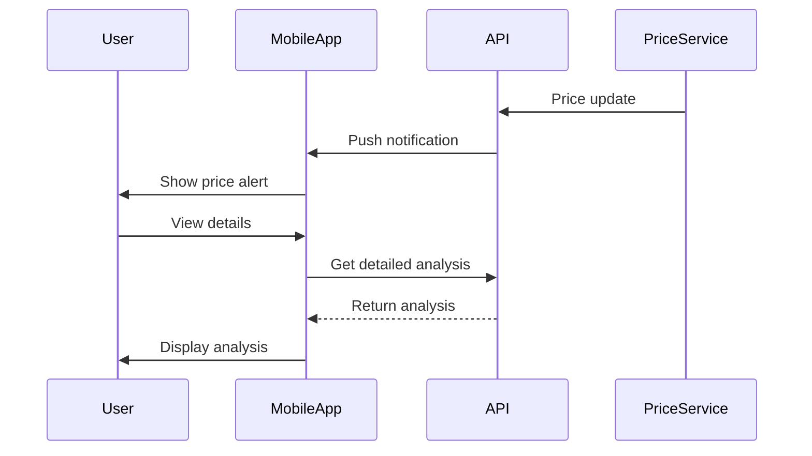
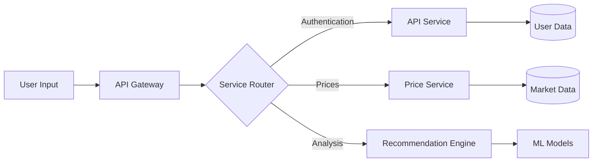
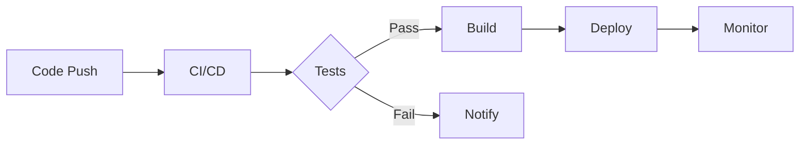

# CoinSight - Distributed Crypto Portfolio & Insights Platform

<p align="center">
  
</p>

CoinSight is a comprehensive cryptocurrency portfolio tracking and analysis platform that provides real-time market data, personalized recommendations, and portfolio management tools.

## Architecture



### Service Overview

1. **Web Dashboard (React)**
   - Real-time portfolio monitoring
   - Interactive charts and analytics
   - Portfolio rebalancing interface

2. **Mobile App (React Native)**
   - On-the-go portfolio tracking
   - Price alerts and notifications
   - Quick trading actions

3. **API Service (Ruby on Rails)**
   - User authentication and authorization
   - Portfolio management
   - Transaction history

4. **Price Service (Go)**
   - Real-time cryptocurrency price aggregation
   - Historical price data storage
   - Price trend analysis

5. **Recommendation Engine (Go)**
   - Portfolio risk analysis
   - Investment recommendations
   - Market sentiment analysis

## Example Scenarios

### 1. Portfolio Rebalancing


### 2. Real-time Price Alerts


## Getting Started

### Prerequisites
- Docker and Docker Compose
- Node.js 18+
- Ruby 3.2.2
- Go 1.20+
- PostgreSQL 14+
- MongoDB 6+

### Local Development Setup
1. Clone the repository
```bash
git clone https://github.com/yourusername/coinsight.git
cd coinsight
```

2. Set up environment variables
```bash
cp .env.example .env
# Edit .env with your configuration
```

3. Start all services
```bash
make up
```

### Service URLs
- Web Dashboard: http://localhost:80
- API Service: http://localhost:3000
- Price Service: http://localhost:8080
- Recommendation Engine: http://localhost:8081

## Mobile App Features

### Portfolio View
```
┌────────────────────┐
│  Portfolio Value   │
│    $125,432.67    │
├────────────────────┤
│ BTC  █████ 45.5%  │
│ ETH  ████  35.2%  │
│ XRP  ██    12.3%  │
│ DOGE █     7.0%   │
└────────────────────┘
```

### Price Alerts
```
📱 Notification
---------------
BTC price alert 🚨
Exceeded $50,000
Tap to view details
---------------
```

## Security Features

- JWT-based authentication
- Secure password hashing
- Rate limiting
- Input validation
- HTTPS enforcement
- API key rotation

## Data Flow



## Development Tools

### Common Commands
```bash
# Start all services
make up

# View logs
make logs

# Run tests
make test-all

# Reset database
make db-reset
```

## Performance Metrics

- API Response Time: < 100ms
- Real-time Price Updates: Every 5 seconds
- Portfolio Calculations: < 1 second
- Mobile App Launch Time: < 2 seconds

## Deployment Pipeline



